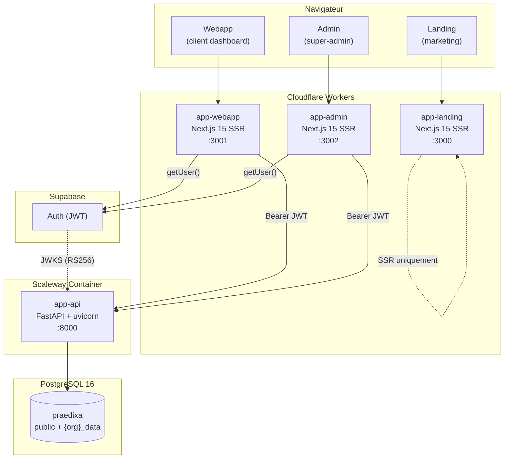
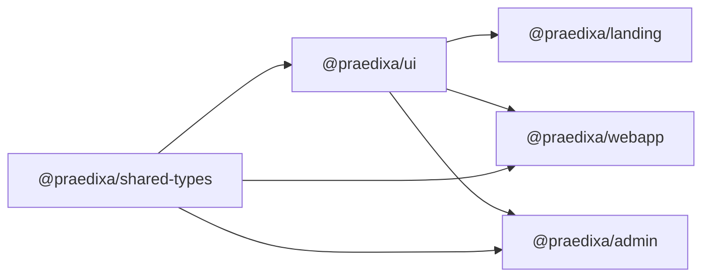
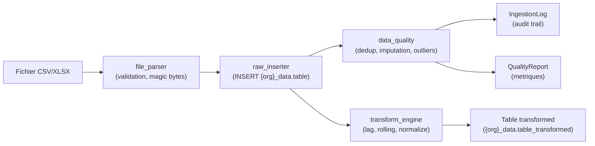
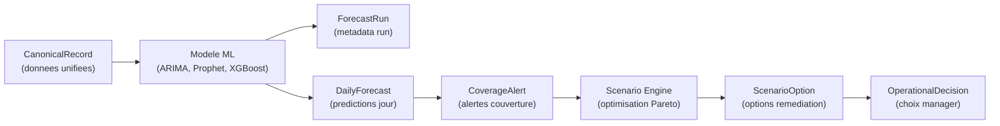
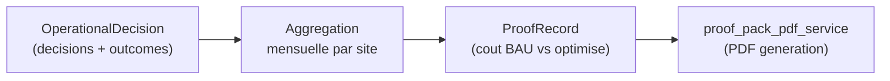

# Architecture de Praedixa

Praedixa est une plateforme SaaS multi-tenant de **capacity planning** pour sites logistiques. Elle predit les absences et la charge de travail, genere des alertes de couverture, et propose des scenarios de remediation optimises.

## Vue systeme



**Legende** : les frontends Next.js tournent sur Cloudflare Workers via `@opennextjs/cloudflare`. L'API tourne dans un conteneur Scaleway. L'authentification passe par Supabase Auth qui emet des JWT verifies cote API par JWKS (RS256/ES256/EdDSA).

## Flux requete

Voici le chemin complet d'une requete authentifiee, du navigateur jusqu'a la base de donnees.

```
Browser
  |
  |  POST /api/v1/decisions  (Authorization: Bearer <jwt>)
  |
  v
Cloudflare Worker (Next.js SSR)
  |
  |  Middleware: getUser() valide la session via Supabase
  |  API call: fetch("https://api.praedixa.com/api/v1/decisions", { headers })
  |
  v
FastAPI (app-api)
  |
  |  1. CORS middleware (allowlist explicite)
  |  2. AuditLogMiddleware (log user_id, org_id, path, status)
  |  3. SlowAPIMiddleware (rate limit par IP)
  |  4. RequestBodySizeLimitMiddleware (max 10 MB)
  |  5. Request ID middleware (X-Request-ID, timing)
  |
  |  Route handler:
  |  6. extract_token() → Bearer token depuis le header Authorization
  |  7. verify_jwt() → decode + validation signature (JWKS), audience, expiry
  |  8. get_current_user() → JWTPayload(user_id, email, organization_id, role, site_id)
  |  9. set_rls_org_id() → ContextVar pour RLS PostgreSQL
  | 10. get_tenant_filter() → TenantFilter(organization_id)
  | 11. get_site_filter() → SiteFilter(site_id | None)
  | 12. get_db_session() → SET LOCAL app.current_organization_id = :org_id
  |
  v
PostgreSQL 16
  |
  |  RLS policies verifient current_setting('app.current_organization_id')
  |  + WHERE organization_id = ? (TenantFilter application-level)
  |  + WHERE site_id = ? (SiteFilter, si applicable)
  |
  v
Response JSON → { success: true, data: [...], timestamp: "..." }
```

## Architecture multi-tenant

L'isolation des donnees repose sur **4 couches de defense en profondeur**. Chaque couche est independante : meme si l'une echoue, les autres bloquent l'acces.

### Couche 1 : JWT `organization_id`

Le claim `organization_id` est extrait du `app_metadata` Supabase, qui est **read-only cote client**. Seul un contexte privilegie Supabase peut le modifier.

```python
# app-api/app/core/auth.py
@dataclass(frozen=True)
class JWTPayload:
    user_id: str
    email: str
    organization_id: str
    role: str
    site_id: str | None = None
```

### Couche 2 : TenantFilter (application-level WHERE)

Chaque requete base de donnees sur une table tenant-scoped **doit** passer par `TenantFilter.apply()` :

```python
# app-api/app/core/security.py
class TenantFilter:
    def __init__(self, organization_id: str) -> None:
        self.organization_id = organization_id

    def apply(self, query: Select[Any], model: Any) -> Select[Any]:
        return query.where(model.organization_id == self.organization_id)
```

### Couche 3 : PostgreSQL RLS via ContextVar

La variable `app.current_organization_id` est injectee dans chaque transaction via `SET LOCAL` (scope transaction, aucune fuite entre requetes) :

```python
# app-api/app/core/database.py
_current_org_id: ContextVar[str | None] = ContextVar("_current_org_id", default=None)

async def get_db_session() -> AsyncGenerator[AsyncSession, None]:
    async with async_session_factory() as session:
        try:
            org_id = _current_org_id.get()
            if org_id is not None:
                await session.execute(
                    text("SET LOCAL app.current_organization_id = :org_id"),
                    {"org_id": org_id},
                )
            yield session
            await session.commit()
        except Exception:
            await session.rollback()
            raise
```

### Couche 4 : SiteFilter (isolation par site)

Pour les utilisateurs affectes a un site specifique, `SiteFilter` ajoute un filtre supplementaire. Quand `site_id` est `None` (cas de l'`org_admin`), aucun filtrage n'est applique.

```python
# app-api/app/core/security.py
class SiteFilter:
    def __init__(self, site_id: str | None) -> None:
        self.site_id = site_id

    def apply(self, query: Select[Any], model: Any) -> Select[Any]:
        if self.site_id is None:
            return query
        return query.where(model.site_id == self.site_id)
```

### Acces admin cross-tenant

Les super-admins peuvent acceder aux donnees de n'importe quelle organisation via `get_admin_tenant_filter`. Cette dependency FastAPI :

1. Verifie le role `super_admin` via `require_role("super_admin")`
2. Accepte un `target_org_id` en parametre de route (valide UUID par FastAPI)
3. Override le `ContextVar` RLS vers l'organisation cible
4. Retourne un `TenantFilter` scope a l'organisation cible

## Graphe de build monorepo

Le monorepo utilise **pnpm workspaces** avec un layout plat :

```
pnpm-workspace.yaml → packages: ["app-*", "packages/*"]
```

L'ordre de build est **strict** a cause des imports inter-packages :



La commande `pnpm build` execute sequentiellement :

```bash
# package.json (root)
pnpm --filter @praedixa/shared-types build  # 1. Types partages
&& pnpm --filter @praedixa/ui build         # 2. Composants UI
&& pnpm --filter @praedixa/landing build    # 3. Apps (parallelisable)
&& pnpm --filter @praedixa/webapp build
&& pnpm --filter @praedixa/admin build
```

**Pourquoi build avant typecheck** : `pnpm typecheck` (alias `tsc --build`) resout les imports depuis les artefacts compiles des packages. Sans build prealable, TypeScript ne trouve pas les declarations de `@praedixa/ui` et `@praedixa/shared-types`.

## Patterns service layer

L'API suit un pattern **Router -> Service -> Session** avec injection de dependances FastAPI.

### Endpoints utilisateur standard

```python
# Pattern typique d'un router
@router.get("/coverage-alerts")
async def list_coverage_alerts(
    session: AsyncSession = Depends(get_db_session),         # DB session
    tenant_filter: TenantFilter = Depends(get_tenant_filter), # Isolation org
    site_filter: SiteFilter = Depends(get_site_filter),       # Isolation site
    current_user: JWTPayload = Depends(get_current_user),     # Auth
) -> SuccessResponse[list[CoverageAlertRead]]:
    items = await coverage_alerts_service.list_alerts(
        session, tenant_filter, site_filter
    )
    return SuccessResponse(success=True, data=items, timestamp=...)
```

### Endpoints admin back-office

Les routers admin utilisent `get_admin_tenant_filter` au lieu de `get_tenant_filter`, compose sous le prefix `/api/v1/admin` :

```python
# app-api/app/main.py
admin_backoffice = APIRouter(prefix="/api/v1/admin", tags=["admin"])
admin_backoffice.include_router(admin_orgs.router)       # 14 sous-routers
admin_backoffice.include_router(admin_users.router)
admin_backoffice.include_router(admin_conversations.router)
# ...
```

### Chaine de dependances

```
get_current_user
  ├─ extract_token(request)    → str (Bearer token)
  ├─ verify_jwt(token)         → JWTPayload
  ├─ set_rls_org_id(org_id)    → ContextVar
  └─ request.state.audit_*     → pour AuditLogMiddleware

get_tenant_filter
  └─ Depends(get_current_user) → TenantFilter(organization_id)

get_site_filter
  └─ Depends(get_current_user) → SiteFilter(site_id | None)

get_admin_tenant_filter
  ├─ Depends(require_role("super_admin"))
  └─ set_rls_org_id(target_org_id) → TenantFilter(target_org_id)

get_db_session
  └─ _current_org_id.get()     → SET LOCAL app.current_organization_id
```

## Packages partages

### `@praedixa/shared-types`

Contient les **types TypeScript du domaine** partages entre webapp et admin :

- Types metier : `Organization`, `Site`, `Department`, `User`, `Employee`
- Enums : `UserRole`, `OrganizationStatus`, `SubscriptionPlan`, etc.
- Types d'API : `ApiResponse<T>`, `PaginatedResponse<T>`, `ErrorResponse`
- Schemas de formulaire : `CreateOrganization`, `UpdateUser`, etc.

**Regle** : tout type utilise par plus d'un frontend vit ici. Les types specifiques a un seul frontend restent locaux.

### `@praedixa/ui`

Contient les **composants React partages** entre les 3 apps :

- Composants de base : `Button`, `Card`, `Input`, `Badge`, `Dialog`
- Composants metier : `DataTable`, `StatCard`, `DetailCard`
- Design system : OKLCH color space, Plus Jakarta Sans / DM Serif Display

**Regle** : seuls les composants utilises par au moins 2 apps migrent dans `@praedixa/ui`.

## Architecture de deploiement

| Cible   | Plateforme         | CI/CD                                   | Configuration                             |
| ------- | ------------------ | --------------------------------------- | ----------------------------------------- |
| Landing | Cloudflare Workers | `.github/workflows/ci.yml` → deploy job | `app-landing/open-next.config.ts`         |
| Webapp  | Cloudflare Workers | `.github/workflows/ci.yml` → deploy job | `app-webapp/open-next.config.ts`          |
| Admin   | Cloudflare Workers | `.github/workflows/ci-admin.yml`        | `app-admin/open-next.config.ts`           |
| API     | Scaleway Container | `.github/workflows/ci-api.yml`          | `app-api/Dockerfile`, `infra/render.yaml` |

### Pipeline CI/CD (GitHub Actions)

Le workflow `ci.yml` (frontend) execute en parallele :

1. **Pre-commit checks** : `prek run --all-files` (formatting, lint, typecheck, vitest, ruff, bandit, gitleaks, pip-audit)
2. **Security audit** : `pnpm audit --audit-level=high`
3. **Secret scanning** : Gitleaks
4. **Bundle size check** : build Cloudflare Workers + verification taille
5. **Frontend coverage** : `vitest run --coverage`
6. **Frontend e2e** : Playwright (chromium)

Apres succes de tous les jobs, le job `deploy` execute le deploiement sur Cloudflare Workers avec verification health check.

Le workflow `ci-api.yml` (backend) execute en parallele :

1. **Lint & Format** : `ruff check` + `ruff format --check`
2. **Unit tests** : `pytest tests/` (100% coverage)
3. **Security scan** : Bandit (`-lll` = HIGH/CRITICAL)
4. **Dependency audit** : `pip-audit`
5. **Secret scanning** : Gitleaks
6. **Integration tests** : PostgreSQL 16 + Alembic migrations + `pytest tests/integration/`

### Infrastructure locale

```bash
# Demarrer PostgreSQL 16 (port 5433 pour eviter les conflits)
docker compose -f infra/docker-compose.yml up -d postgres

# Les apps Next.js tournent nativement (hot reload plus rapide)
pnpm dev:landing   # :3000
pnpm dev:webapp    # :3001
pnpm dev:admin     # :3002
pnpm dev:api       # :8000 (alembic upgrade head + uvicorn --reload)
```

## Securite

Pour le detail complet, voir [`docs/security/`](security/).

### CSP (Content Security Policy)

Chaque frontend genere un **nonce unique par requete** dans son middleware Next.js. Le header CSP est injecte avec `script-src 'nonce-...'` pour bloquer les scripts tiers non autorises.

### CORS

L'API utilise une **allowlist explicite** d'origines (`settings.CORS_ORIGINS`). En production, seuls les domaines HTTPS sont acceptes ; localhost est rejete. Les methodes autorisees sont restreintes a `GET, POST, PATCH, DELETE, OPTIONS`.

### Rate limiting

Trois niveaux via slowapi :

| Niveau   | Limite  | Usage                        |
| -------- | ------- | ---------------------------- |
| Global   | 100/min | Toutes les routes            |
| Auth     | 10/min  | Endpoints d'authentification |
| Sensible | 5/min   | Endpoints critiques          |

L'IP client est extraite via `cf-connecting-ip` (Cloudflare), `X-Forwarded-For`, ou `request.client.host`.

### Audit logging

- **AuditLogMiddleware** : log structlog de chaque requete authentifiee (user_id, org_id, path, status, IP, User-Agent)
- **AdminAuditLog** : table append-only pour les actions super-admin (27 types d'actions). Immutabilite garantie par DB trigger
- **PipelineConfigHistory** : conformite RGPD Article 30 pour les changements de configuration pipeline

### Masquage medical (RGPD Article 9)

Les donnees medicales (motifs d'absence de categorie `sick_leave`, `maternity`, etc.) sont masquees dans les reponses API pour les roles non-autorises. Le service `medical_masking.py` applique ce filtre avant serialisation.

### Gestion des erreurs

La hierarchie `PraedixaError` produit des reponses standardisees :

```json
{
  "success": false,
  "error": { "code": "NOT_FOUND", "message": "Decision not found" },
  "timestamp": "2026-02-10T14:30:00+00:00"
}
```

Les stack traces ne sont **jamais** exposees en production (`DEBUG` est force a `False` en staging/production).

## Flux de donnees

### Pipeline d'ingestion



1. L'utilisateur upload un fichier (max 50 MB, 500k lignes)
2. `file_parser` valide le format (magic bytes), parse CSV/XLSX
3. `raw_inserter` insere dans le schema `{org_slug}_data` via `schema_manager`
4. `data_quality` execute deduplication, imputation, detection d'outliers
5. `transform_engine` calcule les features (lag, rolling mean/std, normalisation)
6. Les resultats sont traces dans `IngestionLog` + `QualityReport`

### Pipeline previsionnel



1. Les `CanonicalRecord` (charge/capacite unifie) alimentent le modele ML
2. Le modele produit des `ForecastRun` + `DailyForecast` par jour/departement
3. Les previsions generent des `CoverageAlert` avec probabilite de rupture
4. Le Scenario Engine optimise des `ScenarioOption` (Pareto-optimal, cout/service)
5. Le manager prend une `OperationalDecision` (avec tracking override)

### Pipeline preuve de valeur



1. Les `OperationalDecision` sont enrichies apres-coup avec les couts observes
2. L'agregation mensuelle calcule le `ProofRecord` (gain_net = cout_bau - cout_reel)
3. Le `proof_pack_pdf_service` genere un PDF de preuve de valeur par site/mois

---

_Voir aussi_ : [DATABASE.md](DATABASE.md) pour le schema de donnees, [docs/security/](security/) pour l'audit de securite complet, [CLAUDE.md](../CLAUDE.md) pour les instructions de developpement.
