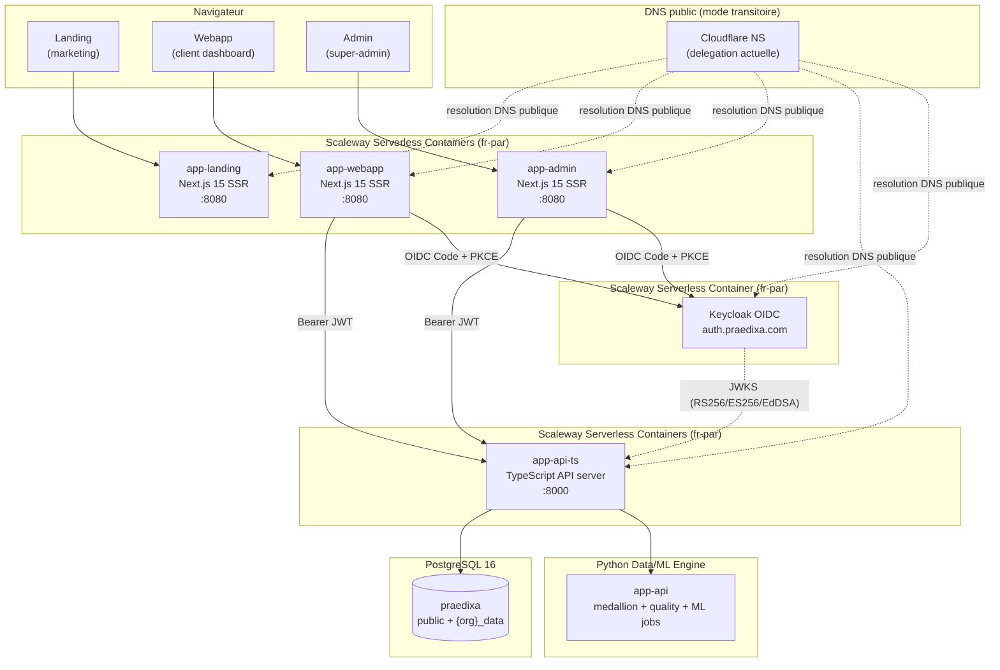
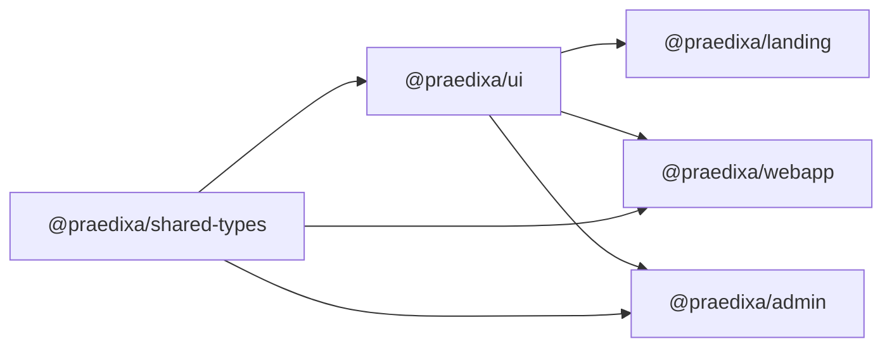
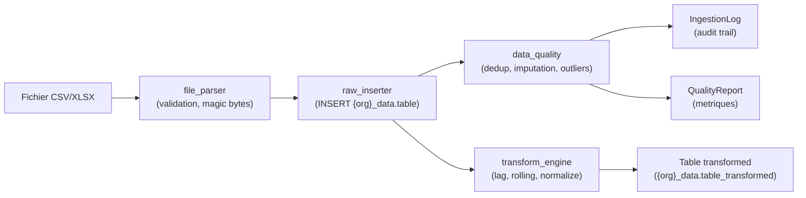
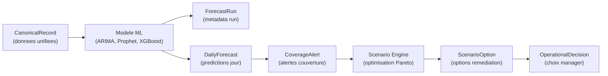
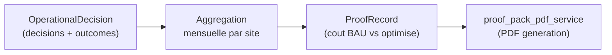

# Architecture de Praedixa

Praedixa est une plateforme SaaS multi-tenant de **capacity planning** pour sites logistiques. Elle predit les absences et la charge de travail, genere des alertes de couverture, et propose des scenarios de remediation optimises.

## Vue systeme



**Legende** : la cible est un hebergement full Scaleway (fr-par) pour les frontends, l'API, et l'IdP OIDC (Keycloak). Tant que la delegation NS n'est pas transferee, le DNS public reste transitoirement sur Cloudflare.

## Flux requete

Voici le chemin complet d'une requete authentifiee, du navigateur jusqu'a la base de donnees.

```
Browser
  |
  |  POST /api/v1/decisions  (Authorization: Bearer <jwt>)
  |
  v
Next.js frontend (Serverless Container, SSR)
  |
  |  Middleware: validation de session OIDC (cookies serveur signes)
  |  API call: fetch("https://api.praedixa.com/api/v1/decisions", { headers })
  |
  v
TypeScript API (app-api-ts)
  |
  |  1. Security headers (HSTS, X-Frame-Options, nosniff, Referrer-Policy)
  |  2. JWT parsing + role enforcement (routes admin vs client)
  |  3. Route handler (contract OpenAPI public)
  |  4. PostgreSQL access (tenant/site scoping)
  |  5. Data/ML orchestration calls vers app-api Python (jobs batch)
  |
  v
PostgreSQL 16
  |
  |  RLS policies verifient current_setting('app.current_organization_id')
  |  + WHERE organization_id = ? (TenantFilter application-level)
  |  + WHERE site_id = ? (SiteFilter, si applicable)
  |
  v
Response JSON → { success: true, data: [...], timestamp: "..." }
```

## Architecture multi-tenant

L'isolation des donnees repose sur **4 couches de defense en profondeur**. Chaque couche est independante : meme si l'une echoue, les autres bloquent l'acces.

### Couche 1 : JWT `organization_id`

Le claim `organization_id` est extrait des claims OIDC (top-level puis `app_metadata`), emis par l'IdP (Keycloak). Les claims sensibles de role/org ne sont pas modifiables cote client.

```python
# app-api/app/core/auth.py
@dataclass(frozen=True)
class JWTPayload:
    user_id: str
    email: str
    organization_id: str
    role: str
    site_id: str | None = None
```

### Couche 2 : TenantFilter (application-level WHERE)

Chaque requete base de donnees sur une table tenant-scoped **doit** passer par `TenantFilter.apply()` :

```python
# app-api/app/core/security.py
class TenantFilter:
    def __init__(self, organization_id: str) -> None:
        self.organization_id = organization_id

    def apply(self, query: Select[Any], model: Any) -> Select[Any]:
        return query.where(model.organization_id == self.organization_id)
```

### Couche 3 : PostgreSQL RLS via ContextVar

La variable `app.current_organization_id` est injectee dans chaque transaction via `SET LOCAL` (scope transaction, aucune fuite entre requetes) :

```python
# app-api/app/core/database.py
_current_org_id: ContextVar[str | None] = ContextVar("_current_org_id", default=None)

async def get_db_session() -> AsyncGenerator[AsyncSession, None]:
    async with async_session_factory() as session:
        try:
            org_id = _current_org_id.get()
            if org_id is not None:
                await session.execute(
                    text("SET LOCAL app.current_organization_id = :org_id"),
                    {"org_id": org_id},
                )
            yield session
            await session.commit()
        except Exception:
            await session.rollback()
            raise
```

### Couche 4 : SiteFilter (isolation par site)

Pour les utilisateurs affectes a un site specifique, `SiteFilter` ajoute un filtre supplementaire. Quand `site_id` est `None` (cas de l'`org_admin`), aucun filtrage n'est applique.

```python
# app-api/app/core/security.py
class SiteFilter:
    def __init__(self, site_id: str | None) -> None:
        self.site_id = site_id

    def apply(self, query: Select[Any], model: Any) -> Select[Any]:
        if self.site_id is None:
            return query
        return query.where(model.site_id == self.site_id)
```

### Acces admin cross-tenant

L'acces admin cross-tenant est controle par les guards de role API TS :

1. JWT requis sur toutes les routes `/api/v1/admin/*`
2. role `super_admin` obligatoire
3. `org_id` cible passe en path et valide cote handler
4. les lectures/ecritures restent scopees au tenant cible

## Graphe de build monorepo

Le monorepo utilise **pnpm workspaces** avec un layout plat :

```
pnpm-workspace.yaml → packages: ["app-*", "packages/*"]
```

L'ordre de build est **strict** a cause des imports inter-packages :



La commande `pnpm build` execute sequentiellement :

```bash
# package.json (root)
pnpm --filter @praedixa/shared-types build  # 1. Types partages
&& pnpm --filter @praedixa/api-ts build     # 2. API TS
&& pnpm --filter @praedixa/ui build         # 3. Composants UI
&& pnpm --filter @praedixa/landing build    # 4. Apps (parallelisable)
&& pnpm --filter @praedixa/webapp build
&& pnpm --filter @praedixa/admin build
```

**Pourquoi build avant typecheck** : `pnpm typecheck` (alias `tsc --build`) resout les imports depuis les artefacts compiles des packages. Sans build prealable, TypeScript ne trouve pas les declarations de `@praedixa/ui` et `@praedixa/shared-types`.

## Patterns service layer

L'API applicative TS suit un pattern **Route table -> Handler -> Service -> DB** :

- Route table centralisee (`app-api-ts/src/routes.ts`)
- Verification JWT + role guard au niveau transport (`app-api-ts/src/server.ts`, `app-api-ts/src/auth.ts`)
- Reponses normalisees (`success`, `paginated`, `failure`)
- Contrat public versionne dans `contracts/openapi/public.yaml`

Le moteur Python reste dedie aux workflows Data/ML :

- pipeline medallion (`app-api/scripts/medallion_pipeline.py`)
- orchestration (`app-api/scripts/medallion_orchestrator.py`)
- inference jobs (`app-api/scripts/run_inference_job.py`)

Le plan d'automation agentique interne vit maintenant dans un runtime TypeScript dedie :

- service Symphony (`app-symphony/`)
- contrat repo-owned `WORKFLOW.md`
- orchestration d'issues Linear, workspaces isoles, harness git worktree et integration `codex app-server`

## Packages partages

### `@praedixa/shared-types`

Contient les **types TypeScript du domaine** partages entre webapp et admin :

- Types metier : `Organization`, `Site`, `Department`, `User`, `Employee`
- Enums : `UserRole`, `OrganizationStatus`, `SubscriptionPlan`, etc.
- Types d'API : `ApiResponse<T>`, `PaginatedResponse<T>`, `ErrorResponse`
- Schemas de formulaire : `CreateOrganization`, `UpdateUser`, etc.

**Regle** : tout type utilise par plus d'un frontend vit ici. Les types specifiques a un seul frontend restent locaux.

### `@praedixa/ui`

Contient les **composants React partages** entre les 3 apps :

- Composants de base : `Button`, `Card`, `Input`, `Badge`, `Dialog`
- Composants metier : `DataTable`, `StatCard`, `DetailCard`
- Design system : OKLCH color space, Plus Jakarta Sans / DM Serif Display

**Regle** : seuls les composants utilises par au moins 2 apps migrent dans `@praedixa/ui`.

## Architecture de deploiement

| Cible   | Plateforme cible                         | Etat DNS/traffic                                            | Configuration / scripts                                          |
| ------- | ---------------------------------------- | ----------------------------------------------------------- | ---------------------------------------------------------------- |
| Landing | Scaleway Serverless Container (`fr-par`) | Exposition publique pilotée via la couche DNS/edge courante | `app-landing/Dockerfile.scaleway`                                |
| Webapp  | Scaleway Serverless Container (`fr-par`) | CNAME public vers Scaleway                                  | `app-webapp/Dockerfile.scaleway`, `pnpm run scw:deploy:webapp:*` |
| Admin   | Scaleway Serverless Container (`fr-par`) | CNAME public vers Scaleway                                  | `app-admin/Dockerfile.scaleway`, `pnpm run scw:deploy:admin:*`   |
| API     | Scaleway Serverless Container (`fr-par`) | CNAME public vers Scaleway                                  | `app-api/Dockerfile`, `pnpm run scw:deploy:api:*`                |
| Auth    | Scaleway Serverless Container (`fr-par`) | CNAME public vers Scaleway                                  | Keycloak `auth-prod` (manuel)                                    |

### Pipeline de verification (gate local exhaustif)

Le gate qualite/securite est local, bloquant, et versionne dans le repo:

1. `pre-commit` execute `scripts/gate-exhaustive-local.sh`
2. `pre-push` verifie un rapport signe lie au `HEAD`
3. si le rapport est absent/stale/invalide, le push est bloque
4. le gate couvre securite, architecture, qualite, tests, e2e, perf, a11y et schema markup

Reference:

- `docs/runbooks/local-gate-exhaustive.md`
- `scripts/gate.config.yaml`

Les deploiements sont executes localement via scripts `scw:*`:

- `scw:bootstrap:*`
- `scw:configure:*`
- `scw:preflight:staging`
- `scw:deploy:*`

### Infrastructure locale

```bash
# Demarrer PostgreSQL 16 (port 5433 pour eviter les conflits)
docker compose -f infra/docker-compose.yml up -d postgres

# Les apps Next.js tournent nativement (hot reload plus rapide)
pnpm dev:landing   # :3000
pnpm dev:webapp    # :3001
pnpm dev:admin     # :3002
pnpm dev:api       # :8000 (API TypeScript)
```

## Securite

Pour le detail complet, voir [`docs/security/`](security/).

### CSP (Content Security Policy)

Chaque frontend genere un **nonce unique par requete** dans son middleware Next.js. Le header CSP est injecte avec `script-src 'nonce-...'` pour bloquer les scripts tiers non autorises.

### CORS

L'API utilise une **allowlist explicite** d'origines (`settings.CORS_ORIGINS`). En production, seuls les domaines HTTPS sont acceptes ; localhost est rejete. Les methodes autorisees sont restreintes a `GET, POST, PATCH, DELETE, OPTIONS`.

### Rate limiting

Trois niveaux via slowapi :

| Niveau   | Limite  | Usage                        |
| -------- | ------- | ---------------------------- |
| Global   | 100/min | Toutes les routes            |
| Auth     | 10/min  | Endpoints d'authentification |
| Sensible | 5/min   | Endpoints critiques          |

L'IP client est extraite via headers proxy (`CF-Connecting-IP`, `X-Forwarded-For`) ou `request.client.host`, selon le point d'entree reseau actif.

### Audit logging

- **AuditLogMiddleware** : log structlog de chaque requete authentifiee (user_id, org_id, path, status, IP, User-Agent)
- **AdminAuditLog** : table append-only pour les actions super-admin (27 types d'actions). Immutabilite garantie par DB trigger
- **PipelineConfigHistory** : conformite RGPD Article 30 pour les changements de configuration pipeline

### Masquage medical (RGPD Article 9)

Les donnees medicales (motifs d'absence de categorie `sick_leave`, `maternity`, etc.) sont masquees dans les reponses API pour les roles non-autorises. Le service `medical_masking.py` applique ce filtre avant serialisation.

### Gestion des erreurs

La hierarchie `PraedixaError` produit des reponses standardisees :

```json
{
  "success": false,
  "error": { "code": "NOT_FOUND", "message": "Decision not found" },
  "timestamp": "2026-02-10T14:30:00+00:00"
}
```

Les stack traces ne sont **jamais** exposees en production (`DEBUG` est force a `False` en staging/production).

## Flux de donnees

### Pipeline d'ingestion



1. L'utilisateur upload un fichier (max 50 MB, 500k lignes)
2. `file_parser` valide le format (magic bytes), parse CSV/XLSX
3. `raw_inserter` insere dans le schema `{org_slug}_data` via `schema_manager`
4. `data_quality` execute deduplication, imputation, detection d'outliers
5. `transform_engine` calcule les features (lag, rolling mean/std, normalisation)
6. Les resultats sont traces dans `IngestionLog` + `QualityReport`

### Pipeline previsionnel



1. Les `CanonicalRecord` (charge/capacite unifie) alimentent le modele ML
2. Le modele produit des `ForecastRun` + `DailyForecast` par jour/departement
3. Les previsions generent des `CoverageAlert` avec probabilite de rupture
4. Le Scenario Engine optimise des `ScenarioOption` (Pareto-optimal, cout/service)
5. Le manager prend une `OperationalDecision` (avec tracking override)

### Pipeline preuve de valeur



1. Les `OperationalDecision` sont enrichies apres-coup avec les couts observes
2. L'agregation mensuelle calcule le `ProofRecord` (gain_net = cout_bau - cout_reel)
3. Le `proof_pack_pdf_service` genere un PDF de preuve de valeur par site/mois

---

_Voir aussi_ : [DATABASE.md](DATABASE.md) pour le schema de donnees, [docs/security/](security/) pour l'audit de securite complet, [CLAUDE.md](../CLAUDE.md) pour les instructions de developpement.
