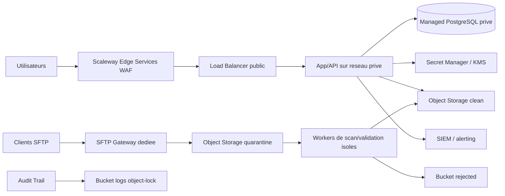

# PRD - Cybersecurite "porte blindee" pour une plateforme SaaS sur Scaleway

**Statut**: cible recommandee
**Date**: 2026-03-19
**Perimetre**: infra Scaleway, auth, secrets, stockage, ingestion fichiers, logs, backup/restore, incident response, CI/CD
**Execution repo**: voir `docs/security/scaleway-fortress-control-matrix.md`

## 1. Resume executif

L'objectif n'est pas de "faire un peu de securite". L'objectif est d'obtenir une architecture defensive a couches avec reduction forte de la surface d'attaque, cloisonnement strict, secrets centralises, authentification robuste, ingestion de fichiers en quarantaine, journalisation exploitable, sauvegardes restaurables, et procedures d'incident deja ecrites avant la premiere vraie crise.

Le niveau cible doit etre au minimum equivalent a **OWASP ASVS Level 2** sur toute application qui manipule des donnees clients, avec un sous-ensemble de controles **Level 3** pour l'authentification, la gestion des secrets, l'administration et l'isolation multi-tenant. Le principe directeur est simple: aucun composant seul ne doit suffire a compromettre tout le systeme.

## 2. Contexte et perimetre

Ce PRD couvre:

- l'infrastructure Scaleway;
- l'authentification utilisateurs et administrateurs;
- la reception de fichiers `csv` / `xlsx` par SFTP;
- le stockage de donnees clients;
- les adresses email clientes;
- les mots de passe et secrets techniques;
- la journalisation, le monitoring et l'audit;
- les sauvegardes, la restauration et la reprise;
- la reponse a incident;
- la chaine CI/CD et la supply chain logicielle.

Le design cible s'appuie sur les briques Scaleway suivantes:

- VPC / Private Networks;
- IAM;
- Secret Manager;
- Key Manager;
- Managed Databases;
- Object Storage avec versioning et object lock;
- Audit Trail;
- Load Balancer;
- Edge Services WAF.

## 3. Objectifs produit

1. Heberger et traiter les donnees clients sur Scaleway en France, dans `fr-par`, avec cloisonnement strict entre internet, application, base, stockage brut, stockage nettoye et journalisation.
2. Faire en sorte que la base de production ne soit jamais exposee publiquement; toutes les connexions SQL doivent etre chiffrees en TLS/SSL, avec chiffrement at rest active des la creation.
3. Exiger MFA partout ou c'est critique, avec preference pour des facteurs resistants au phishing.
4. Interdire tout stockage en clair des mots de passe et secrets; utiliser un KDF moderne pour les mots de passe, avec **Argon2id** en choix prefere.
5. Considerer tout `csv`/`xlsx` entrant comme potentiellement hostile, avec pipeline obligatoire quarantaine -> scan -> validation -> parsing isole -> promotion controlee.
6. Garantir que les journaux de securite soient exploitables sans jamais contenir de secret.
7. Preparer la reponse a incident et la conformite RGPD, y compris la notification sous 72 heures si necessaire.

## 4. Non-objectifs

Ce PRD ne vise pas une certification immediate ISO 27001, SOC 2 ou HDS. En revanche, il doit preparer le terrain pour ces demarches en instaurant tres tot les bons reflexes d'architecture, de preuve, de gouvernance et de restoration.

## 5. Modele de menace

Les menaces principales a couvrir sont:

- compromission d'identifiants via phishing, credential stuffing, mots de passe faibles ou reset mal securise;
- erreur de configuration cloud ou IAM;
- fichier `csv`/`xlsx` malveillant, macro, contenu inattendu ou tentative de CSV injection;
- exfiltration de donnees via logs, backups, exports, emails ou environnements de dev;
- elevation de privilege cote admin;
- acces inter-tenant par bug d'autorisation;
- compromission de la CI/CD ou d'une dependance;
- suppression ou alteration des preuves et logs apres compromission.

## 6. Architecture cible

Regles structurantes:

- le Load Balancer public est le seul point d'entree internet du front web;
- les backends applicatifs, la base, les workers d'ingestion et le stockage de logs restent en reseau prive;
- tout service public additionnel passe par un composant frontal dedie avec WAF et regles minimales;
- le trafic lateral sur Private Network doit aussi etre filtre au niveau host firewall ou equivalent, pas seulement par les security groups publics.

## 7. Exigences detaillees

### 7.1 Gouvernance IAM et acces humains

- un compte nominatif par humain; aucun compte partage;
- roles attribues via groupes et policies IAM, avec deny-by-default;
- comptes a privileges rares, temporaires si possible, et revus mensuellement;
- MFA obligatoire pour tous les comptes humains internes;
- passkeys / WebAuthn obligatoires pour les admins et fortement recommandes pour les clients;
- TOTP accepte en fallback;
- SMS interdit comme second facteur principal;
- API keys limitees dans le temps, stockees dans Secret Manager, rotatees et revoquees a la sortie d'un collaborateur.

### 7.2 Authentification client

Par defaut, l'authentification doit etre deleguee a un fournisseur **OIDC / SSO** externe. Si un mot de passe local existe malgre tout:

- hash obligatoire en Argon2id;
- baseline minimale compatible OWASP, par exemple `19 MiB`, `2` iterations, `parallelism=1`, puis tuning selon le budget de latence;
- salage unique par compte;
- pepper applicatif stocke hors base, dans Secret Manager ou KMS/HSM logique;
- aucune recuperation de mot de passe en clair possible;
- blocklist de mots de passe interdits;
- rate limiting et anti-bruteforce obligatoires;
- messages generiques contre l'enumeration de comptes;
- collage depuis password manager autorise.

Reset mot de passe:

- jeton aleatoire cryptographiquement sur;
- usage unique;
- expiration courte, 15 minutes recommande;
- URL HTTPS seulement;
- domaine de reset fige cote serveur, jamais derive du `Host` header;
- re-authentification obligatoire apres reset ou evenement a risque.

Sessions:

- cookies `Secure`, `HttpOnly`, `SameSite=Lax` ou `Strict` selon l'UX;
- rotation d'identifiant au login, au changement de privilege et apres reset;
- invalidation serveur des sessions revoquees;
- CSRF tokens sur toute requete state-changing si auth par cookies;
- timeouts d'inactivite et absolus documentes;
- liste des sessions actives visible cote utilisateur pour revocation.

### 7.3 Reseau, calcul et exposition

Regles imperatives:

- aucun SSH ouvert sur les noeuds applicatifs depuis internet;
- acces admin via bastion dedie ou VPN seulement, avec IP allowlist si possible;
- separation prod / staging / dev au minimum par Projects distincts, voire par Organizations pour les environnements les plus critiques;
- reseau prive distinct pour la production;
- flux inter-environnements reduits au strict minimum;
- durcissement OS et host firewall obligatoires.

### 7.4 Secrets, cles et crypto

Tous les secrets techniques doivent etre centralises dans **Secret Manager**:

- aucun secret de longue duree dans Git, dans le code ou dans des `.env` partages;
- aucune valeur live dans les tickets, docs ou messageries;
- rotation automatique quand possible;
- cles distinctes par environnement;
- separation stricte entre secrets applicatifs, CI/CD et ops;
- chiffrement des donnees sensibles au repos avec algorithmes reconnus;
- pour les mots de passe, hachage uniquement, jamais chiffrement reversible.

### 7.5 Base de donnees et isolation multi-tenant

Pour les clients sensibles ou premium, preferer une isolation par base dediee ou schema dedie. Si des tables partagees sont conservees:

- `tenant_id` obligatoire sur toute table multi-tenant;
- filtre tenant impose cote data access layer;
- **RLS PostgreSQL** obligatoire;
- contexte tenant derive de la session authentifiee, jamais d'un header client libre;
- cles de cache prefixees par tenant;
- chemins Object Storage prefixes par tenant;
- alerting sur tentative d'acces cross-tenant;
- suppression complete des donnees a l'offboarding;
- pseudonymisation ou anonymisation des datasets d'analyse hors prod.

### 7.6 SFTP d'ingestion de fichiers

Le SFTP doit etre une passerelle dediee, mono-usage et separee de l'application:

- un compte SFTP par client;
- authentification par cle SSH uniquement;
- mots de passe SFTP desactives;
- IP allowlist si le client peut la fournir;
- chroot / jail par client;
- depot dans une drop zone write-only;
- aucun traitement direct dans le repertoire d'arrivee;
- tout upload est copie immediatement vers un bucket `quarantine`;
- traitement par worker isole;
- original conserve chiffre avec retention courte;
- fichiers rejetes envoyes vers `rejected`;
- fichiers valides promus vers `clean`.

### 7.7 Politique de fichiers CSV/XLSX

Formats acceptes:

- `csv`
- `tsv`
- `xlsx`

Formats rejetes par defaut:

- `xls`
- `xlsm`
- `xlsb`
- archives imbriquees;
- executables;
- formats binaires opaques;
- fichiers macro-enabled.

Pipeline obligatoire:

1. checksum SHA-256;
2. scan anti-malware;
3. controle de taille, extension, MIME et magic bytes;
4. parsing dans un conteneur jetable sans acces internet sortant ni acces prod;
5. validation de schema;
6. sanitation des encodages;
7. controle des colonnes autorisees;
8. journalisation du resultat;
9. promotion seulement si tout est vert.

Exigences complementaires:

- aucun humain n'ouvre manuellement un fichier client brut sur son laptop;
- les exports CSV neutralisent toute cellule commencant par `=`, `+`, `-`, `@` ou des caracteres de controle;
- les macros Office sont interdites;
- toute transformation est tracable et versionnee.

### 7.8 Emails clients et messagerie

Les emails clients sont des donnees personnelles:

- minimisation obligatoire;
- masquage dans les vues non necessaires;
- absence des logs;
- absence des exports inutiles;
- politique de conservation claire;
- liens transactionnels a usage limite, sans donnee sensible;
- pieces jointes contenant des donnees clients interdites par defaut; utiliser le portail securise ou le SFTP.

Messagerie interne:

- MFA obligatoire sur toutes les boites internes;
- jamais de mot de passe ou secret transmis par email;
- mettre en place DMARC / SPF / DKIM sur les domaines.

### 7.9 Logging, supervision et detection

Les logs doivent etre centralises, horodates, rendus immuables autant que possible, et contenir le contexte necessaire sans secret:

- contexte tenant, user, environnement et correlation de requete;
- login succes / echec;
- activation / desactivation MFA;
- reset mot de passe;
- changement de role;
- creation / revocation de cle API;
- acces admin;
- upload SFTP;
- verdict scan;
- erreur de validation;
- acces refuse inter-tenant;
- export de donnees;
- consultation de secrets;
- restauration backup;
- modification infra;
- evenements WAF.

Interdits dans les logs:

- secrets;
- cles;
- certificats;
- tokens;
- contenu des fichiers clients;
- mots de passe;
- PII non necessaire.

Audit Trail doit etre active et exporte vers un bucket Object Storage avec object lock.

### 7.10 Sauvegardes, continuite et restauration

Exigences:

- sauvegardes automatiques quotidiennes minimum;
- si le budget le permet, haute disponibilite sur la base managée;
- copie immuable des journaux de securite;
- sauvegardes exportees chiffrees;
- test de restauration mensuel;
- exercice de reprise trimestriel;
- aucun changement de procedure sans restauration testee;
- suppression de backup prod soumise a approbation a deux personnes.

### 7.11 DevSecOps et chaine logicielle

Exigences CI/CD:

- branche principale protegee;
- commits signes;
- revue obligatoire a 2 yeux sur les changements sensibles;
- SAST, SCA, secret scanning et IaC scanning en CI;
- DAST sur staging;
- SBOM a chaque release;
- blocage des builds si vulnerabilite critique non acceptee formellement;
- images figees, signees et tracables;
- deploiements immuables avec rollback;
- jamais de secret prod dans l'environnement de dev;
- aucune copie de base prod en dev.

## 8. Criteres d'acceptation

Le projet est considere conforme quand:

- 100 % des comptes internes ont MFA active;
- 100 % des secrets techniques sont sortis du code et centralises;
- 0 base de prod est exposee publiquement;
- 0 mot de passe est stocke en clair;
- 0 secret apparait dans les logs;
- 100 % des uploads passent par la quarantaine;
- 100 % des environnements prod / staging / dev sont isoles;
- 100 % des evenements admin sont auditables;
- 1 restauration complete de backup reussit au moins chaque mois;
- 1 test d'acces cross-tenant automatise tourne a chaque release;
- 1 runbook d'incident est executable de bout en bout;
- 1 export Audit Trail est protege par object lock.

## 9. Plan de deploiement

### Phase 0 - Immediate

- IAM propre;
- MFA;
- Secret Manager;
- separation des Projects;
- private networking;
- base managée privee;
- TLS DB;
- backups;
- logs centralises;
- WAF en mode log;
- SFTP dedie;
- quarantaine fichiers;
- hash Argon2id.

### Phase 1 - 30 jours

- passkeys admins;
- rotation automatisee des secrets;
- object lock sur logs;
- policy de retention;
- SIEM + alerting;
- scans CI/CD;
- signatures commits;
- tests cross-tenant.

### Phase 2 - 60 a 90 jours

- WAF en blocage;
- revue complete des privileges;
- exercices restore;
- drill incident;
- segmentation plus fine;
- retention automatisee;
- suppression offboarding;
- KPI securite mensuels.

## 10. Anti-patterns explicitement interdits

- base de donnees prod avec endpoint public;
- mot de passe en clair, meme temporaire;
- mot de passe envoye par email;
- secret dans Git, Notion, Slack, ticket ou `.env` partage;
- fichier client brut ouvert a la main sur un laptop;
- copie prod vers dev;
- tenant ID pris depuis un header sans validation;
- logs contenant PII sensible ou tokens;
- compte admin partage;
- cles API sans expiration;
- bucket public par commodite;
- acces SSH internet direct aux noeuds applicatifs.

## 11. Decision d'architecture recommandee

Version cible recommandee:

- Scaleway en `fr-par`;
- front public derriere Edge Services WAF + Load Balancer;
- tout le reste en reseau prive;
- base managée privee chiffree;
- secrets dans Secret Manager;
- SFTP isole avec pipeline de quarantaine;
- auth client via OIDC;
- passkeys pour admins;
- Argon2id seulement si un mot de passe local subsiste;
- logs centralises sans secrets;
- Audit Trail exporte en object lock;
- restore drills mensuels;
- zero donnee prod en dev.

## 12. References

- [OWASP ASVS](https://owasp.org/www-project-application-security-verification-standard/)
- [Scaleway IAM](https://www.scaleway.com/en/docs/iam/)
- [Scaleway regions et Private Network](https://www.scaleway.com/en/docs/public-gateways/concepts/)
- [Scaleway Managed Databases security and reliability](https://www.scaleway.com/en/docs/managed-databases-for-postgresql-and-mysql/reference-content/security-and-reliability/)
- [NIST SP 800-63B-4](https://nvlpubs.nist.gov/nistpubs/SpecialPublications/NIST.SP.800-63B-4.pdf)
- [CNIL - chiffrement, hachage, signature](https://www.cnil.fr/fr/securite-chiffrement-hachage-signature)
- [OWASP File Upload Cheat Sheet](https://cheatsheetseries.owasp.org/cheatsheets/File_Upload_Cheat_Sheet.html)
- [OWASP Logging Vocabulary Cheat Sheet](https://cheatsheetseries.owasp.org/cheatsheets/Logging_Vocabulary_Cheat_Sheet.html)
- [CNIL - notifier une violation de donnees](https://www.cnil.fr/fr/services-en-ligne/notifier-une-violation-de-donnees-personnelles)
- [OWASP Proactive Controls - Access Control](https://top10proactive.owasp.org/the-top-10/c1-accesscontrol/)
- [Scaleway Load Balancer + Private Network](https://www.scaleway.com/en/docs/load-balancer/how-to/use-with-private-network/)
- [Scaleway Edge Services](https://www.scaleway.com/en/docs/edge-services/)
- [Scaleway Security Groups](https://www.scaleway.com/en/docs/instances/how-to/use-security-groups/)
- [CNIL - guide securite personnelle 2024](https://www.cnil.fr/sites/cnil/files/2024-03/cnil_guide_securite_personnelle_2024.pdf)
- [OWASP Multifactor Authentication Cheat Sheet](https://cheatsheetseries.owasp.org/cheatsheets/Multifactor_Authentication_Cheat_Sheet.html)
- [OWASP Authentication Cheat Sheet](https://cheatsheetseries.owasp.org/cheatsheets/Authentication_Cheat_Sheet.html)
- [OWASP Password Storage Cheat Sheet](https://cheatsheetseries.owasp.org/cheatsheets/Password_Storage_Cheat_Sheet.html)
- [OWASP Forgot Password Cheat Sheet](https://cheatsheetseries.owasp.org/cheatsheets/Forgot_Password_Cheat_Sheet.html)
- [OWASP Session Management Cheat Sheet](https://cheatsheetseries.owasp.org/cheatsheets/Session_Management_Cheat_Sheet.html)
- [ANSSI - guide cybersecurite start-up numerique](https://messervices.cyber.gouv.fr/documents-guides/guide_cybersecurite_start-up_numerique_FR_v1.pdf)
- [OWASP Secrets Management Cheat Sheet](https://cheatsheetseries.owasp.org/cheatsheets/Secrets_Management_Cheat_Sheet.html)
- [OWASP Multi-Tenant Security Cheat Sheet](https://cheatsheetseries.owasp.org/cheatsheets/Multi_Tenant_Security_Cheat_Sheet.html)
- [CNIL - RGPD](https://www.cnil.fr/fr/reglement-europeen-protection-donnees)
- [ANSSI - note technique OpenSSH](https://messervices.cyber.gouv.fr/documents-guides/NT_OpenSSH.pdf)
- [Scaleway Object Storage bucket policy](https://www.scaleway.com/en/docs/object-storage/api-cli/bucket-policy/)
- [CNIL - principes RGPD / limitation de conservation](https://www.cnil.fr/fr/reglement-europeen-protection-donnees/chapitre2)
- [ANSSI - MFA et mots de passe](https://messervices.cyber.gouv.fr/documents-guides/anssi-guide-authentification_multifacteur_et_mots_de_passe.pdf)
- [Scaleway Managed Databases FAQ](https://www.scaleway.com/en/docs/managed-databases-for-postgresql-and-mysql/faq/)
- [OWASP Dependency Graph SBOM Cheat Sheet](https://cheatsheetseries.owasp.org/cheatsheets/Dependency_Graph_SBOM_Cheat_Sheet.html)
